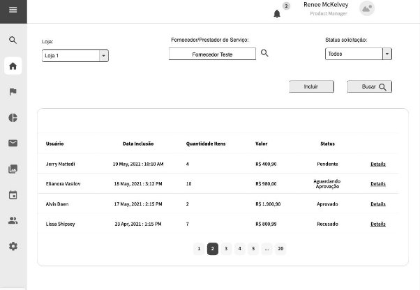
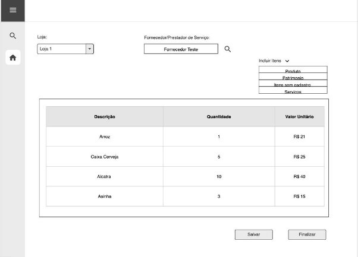
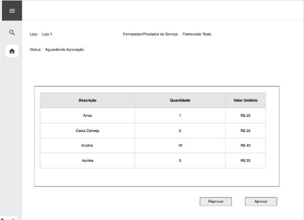
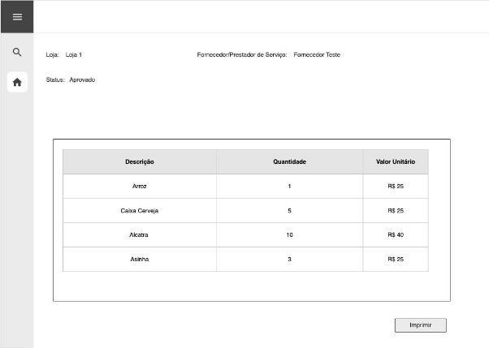

# Desafio 2 - Movimento-QA 2023

- **Job statements (Principal) - Novo**

Controlar solicitações/requisições de compra da empresa.

*Descrição: Controlar as solicitações de compras de consumo ou de serviço, informando produto, quantidade e valor, bem como submeter a requisição à aprovação do superior.*

- **Job Stories (O nosso User Stories, Resultado Esperado)**

Ao solicitar compra de materiais ou serviços, gostaria de ter um controle no sistema, de forma que os solicitantes possam informar os produtos, quantidade, valor e fornecedor/prestador, além disso, precisamos que tenha um processo de aprovação, para que desta forma tenhamos maior controle das despesas, evitando perdas e desperdícios.

- **Qual o problema? (Background Pensamento A3)**

Resumo: Compras de consumo sem aprovação / Perda de controle do orçamento das despesas.

Nesta requisição, informam os dados de Fornecedor/Prestador, Produto, Quantidade, Valor.

O usuário imprime esta requisição e leva até o fornecedor, que por sua vez, disponibiliza os itens requisitados, e assina o documento, que futuramente, será faturado em NF gerando assim a cobrança ao nosso cliente.

- **Objetivo do desenvolvimento (Para desenvolvedores)**
- Implementar novo tipo de Solicitação de Compra;
- Criar permissões específicas para o novo tipo de Solicitação;
- Implementar filtro de Fornecedor;
- Possibilitar adicionar Produtos, Patrimônio, Serviços e Item sem Cadastro;
- Implementar novas colunas:
  - Descrição
  - Quantidade;
  - Valor Unitário;
  - Valor Total.
- Implementar uma impressão simples com os dados da nova solicitação.
- Implementar a requisição de aprovação da solicitação **Cenário atual**

No Bluesoft, atualmente o cliente está fazendo controle manual (excel), pois não temos a ferramenta.

**Cenário Sugerido**

No sistema teremos um novo menu onde irá buscar e incluir as solicitações de compra.

Na busca teremos os seguintes filtros: loja, um fornecedor ou prestador de serviço e status da solicitação.

Para incluir uma solicitação será necessário selecionar uma loja, um fornecedor ou prestador de serviço e ter um botão para incluir itens na solicitação, ao clicar nesse botão o sistema irá apresentar as opções Produtos, Patrimônio, Serviços e Item sem Cadastro.

- Caso seja selecionado as opções Produtos ou Patrimônio, o sistema irá abrir uma tela de pesquisa de cadastros de produtos onde é possível selecionar um ou mais itens de uma única vez. Depois de selecionados o usuário deverá informar a quantidade e valor unitário de cada item.
- Caso seja selecionado as opções Serviços ou Item sem Cadastro será incluído uma linha onde o usuário deverá informar descrição,  quantidade e valor unitário.

Depois de informados os itens, o usuário terá 2 opções:

- Salvar: onde o status dessa solicitação ainda ficará como pendente
- Finalizar: onde o status dessa solicitação ficará como aguardando aprovação.

Caso o usuário tenha a permissão de aprovar as solicitações ao visualizar uma solicitação o sistema irá apresentar um botão de Aprovar Solicitação.

Depois de uma solicitação ser aprovada ela pode ser impressa, então ao visualizar a solicitação irá apresentar um botão para impressão.

